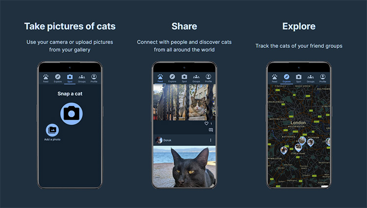

# Marcel the Cat

Marcel the Cat is a free photo-sharing web application that allows users to take pictures of cats and share them with people all around the world. You can also track the cats of your friend groups and explore your neighborhood cats.

## Usage

To use Marcel the Cat, simply go to [https://www.marcelthecat.com/](https://www.marcelthecat.com/) and start sharing your cat pictures with the world.

## Tech Stack

Marcel the Cat is built using the following tech stack:

- React
- Node.js
- Express
- MongoDB
- Vite

## Contributing

If you would like to contribute to Marcel the Cat, feel free to submit a pull request. We welcome any contributions, whether they are bug fixes, feature requests, or general improvements to the codebase.
Check the [To-Do list](./TODO.md)
